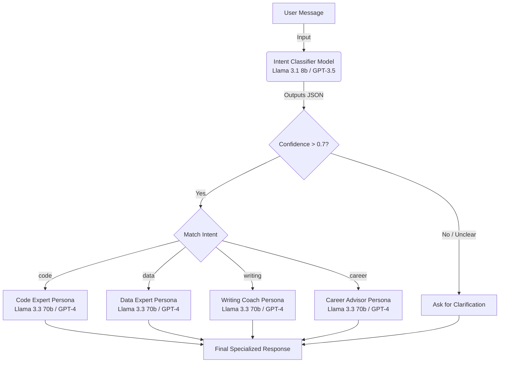

# LLM-Powered Prompt Router for Intent Classification

This application intelligently routes user requests to specialized AI personas based on classified intent. It uses a two-step process: first, it classifies the user's intent using a lightweight LLM call, and then it routes the message to an expert persona for a high-quality, specialized response.

## 🚀 Real-World Use Case
Imagine an **Enterprise Customer Support Bot**. Instead of one massive bot struggling to handle everything, our system:
1. **Detects intent** (e.g., Billing, Tech Support, Sales).
2. **Routes** to a highly specialized agent prompt.
3. Provides a **high-quality, domain-specific** answer, avoiding mixed-up instructions.

---

## 🏗️ High-Level Architecture & Flow

## Interface Options
- **Web UI (Recommended)**: A premium, modern dashboard to visualize classification and see expert responses.
- **Interactive CLI**: Real-time chat mode in the terminal.
- **Batch Testing**: Automated runner for the 20+ test scenarios.

## Advanced Features (Stretch Goals)
The application goes beyond the basic requirements with several advanced features:
- **Premium Web UI**: A modern dashboard featuring glassmorphism, real-time confidence bars, and responsive markdown rendering.
- **Provider-Agnostic Engine**: Automatic detection for **Groq** and **OpenAI** API keys. If a Groq key is used, the system automatically redirects to Groq's API and optimizes model selection (`Llama 3.1/3.3`).
- **Confidence Thresholding**: Implemented a `CONFIDENCE_THRESHOLD = 0.7`. Classification results below this score are automatically redirected to the clarification flow to prevent hallucinations.
- **Manual Intent Overrides**: Users can bypass the AI classifier by prefixing their messages with `@intent` (e.g., `@code`, `@data`, `@writing`, `@career`).
- **Port Resiliency**: The Flask server handles port conflicts gracefully, ensuring the application stays runnable even if port 5000 is occupied.

## Design Decisions & Architecture
### 1. Two-Step Routing Architecture
We separate the "Thinking" (Classification) from the "Doing" (Generation). This allows us to use cheap, fast models for intent detection and highly specialized, instruction-dense prompts for the expert personas. This design is significantly more scalable and resistant to "prompt leakage" than a single monolithic prompt.

### 2. Configurable 'Expert' Personalities
All system prompts are isolated in `prompts.json`. Each expert has a distinct tone, style, and set of constraints defined in their persona, ensuring high-quality specialized responses without overlapping behaviors.

### 3. Observability with JSONL
We use JSON Lines for logging. This ensures that even if the app crashes during a session, all historical logs remain valid JSON objects. Each entry includes:
- `intent`: The classified category.
- `confidence`: The model's certainty score.
- `user_message`: The raw input.
- `final_response`: The routed expert's answer.

### 4. Robustness & Error Handling
The `classify_intent` function is wrapped in defensive try-except blocks. Any LLM parsing failure defaults to the `unclear` intent with `0.0` confidence. This ensures the system always remains conversational and never crashes due to unexpected API responses.

---

## ⚙️ Challenges & Solutions

| Challenge | How it was Solved |
| :--- | :--- |
| **Ambiguous Intents** The classifier struggled to differentiate between "creative writing" (generate a poem) and "editing" (fix my grammar). | **Explicit Prompt Constraints** Added strict negative constraints to the `classification_prompt`: *"CRITICAL RULE: The 'writing' category is ONLY for editing... generating from scratch MUST be 'unclear'."* |
| **JSON Parsing Errors** LLMs occasionally return invalid JSON, crashing the backend. | **Defensive Error Handling** Implemented `try-except` blocks. If parsing fails, it safely defaults to the `unclear` intent with `0.0` confidence to keep the system running gracefully. |

---

## 🔮 Limitations & Future Scope

- **Current Limitation:** The system is stateless and does not retain conversation memory, meaning follow-up questions lack context.
- **Future Improvement (Memory):** Implement a Vector DB (like Pinecone) or simple session-based memory arrays for context-aware follow-ups.
- **Future Improvement (Speed):** Add a caching layer (Redis) to instantly return responses for identical queries without hitting the LLM API.
- **Future Improvement (UX):** Implement Server-Sent Events (SSE) for streaming responses to the frontend.

---

## 🧪 Verification & Testing
The system includes a batch test suite in `test_router.py` containing **27 test cases** that evaluate:
- Clear intent detection.
- Multi-intent queries.
- Creative writing edge cases (Poems/Stories).
- Manual overrides.
- Typos and ambiguous inputs.
